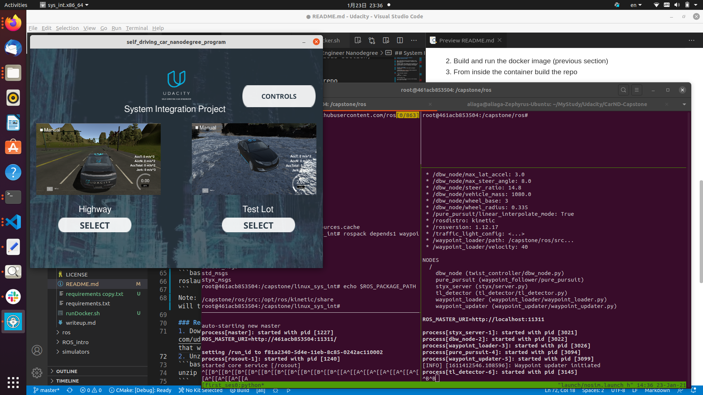

# Udacity Self-Driving Engineer Nanodegree
## System Integration Project


This is the project repo for the final project of the Udacity Self-Driving Car Nanodegree: Programming a Real Self-Driving Car. 

Although in theory this project can be run natively or in a virtual machine, I have performed all operation using Docker and that is how it is explained in this Readme.


### Docker Installation
* [Install Docker](https://docs.docker.com/engine/installation/)

* Download the [Udacity Simulator](https://github.com/udacity/CarND-Capstone/releases).


* Build the docker container:

```bash
docker build . -t capstone
```

* Run the docker file:

To run the docker container, you can use the following shell script (in the repo):


```bash
./runDocker.sh 
```


### Usage

1. Clone the project repository 
```bash
git clone https://github.com/KansaiUser/Capstone-.git 
```

2. Build and run the docker image (previous section)


3. From inside the container build the repo
```bash
cd ros
catkin_make
source devel/setup.sh
echo $ROS_PACKAGE_PATH 
```

Make sure that `/capstone/ros/src/` is part of the path. 

Note: You have to source devel/setup.sh everytime you open a new terminal. 

4. Run the simulator (outside the container)

To run the simulator, after downloading it (see above), you have to untar the tar file, make sure that the resulting file `sys_int.x86_64` is executable (if not run `sudo chmod 777 sys_int.x86_64`) and then *from the graphical Files application (like file explorer)* double-click the Icon. 

5. Run styx (inside the container)
```bash
roslaunch launch/nosim.launch
```
Note: *Do not* launch the styx.launch file since this will try to run the simulation and it will crash. 




(The screenshot uses tmux, which divides the terminal in panes. Don't pay too much attention to this.)


-------------------------


### Real world testing
1. Download [training bag](https://s3-us-west-1.amazonaws.com/udacity-selfdrivingcar/traffic_light_bag_file.zip) that was recorded on the Udacity self-driving car.
2. Unzip the file
```bash
unzip traffic_light_bag_file.zip
```
3. Play the bag file
```bash
rosbag play -l traffic_light_bag_file/traffic_light_training.bag
```
4. Launch your project in site mode
```bash
cd CarND-Capstone/ros
roslaunch launch/site.launch
```
5. Confirm that traffic light detection works on real life images

### Other library/driver information
Outside of `requirements.txt`, here is information on other driver/library versions used in the simulator and Carla:

Specific to these libraries, the simulator grader and Carla use the following:

|        | Simulator | Carla  |
| :-----------: |:-------------:| :-----:|
| Nvidia driver | 384.130 | 384.130 |
| CUDA | 8.0.61 | 8.0.61 |
| cuDNN | 6.0.21 | 6.0.21 |
| TensorRT | N/A | N/A |
| OpenCV | 3.2.0-dev | 2.4.8 |
| OpenMP | N/A | N/A |

We are working on a fix to line up the OpenCV versions between the two.
