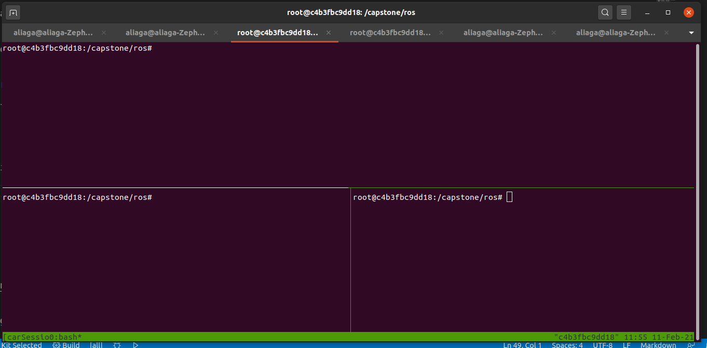
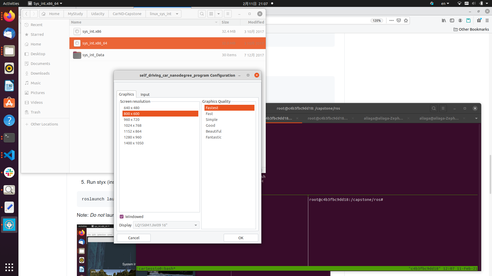
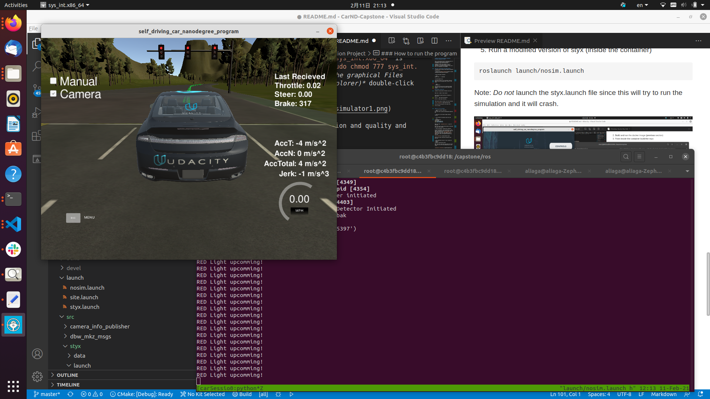

# Udacity Self-Driving Engineer Nanodegree
## System Integration Project


This is the project repo for the final project of the Udacity Self-Driving Car Nanodegree: Programming a Real Self-Driving Car. 

Although in theory this project can be run natively or in a virtual machine, I have performed all operations using Docker and that is how it is explained in this Readme.


### Docker Installation and image building
* [Install Docker](https://docs.docker.com/engine/installation/)

* Download the [Udacity Simulator](https://github.com/udacity/CarND-Capstone/releases).


* Build the docker container:

```bash
docker build . -t capstone2
```

* Run the docker file:

Everytime you want to run the docker container, you can use the following shell script (in the repo):


```bash
./runDocker.sh 
```
once you do this you will be inside the docker container which has ROS installed (among other things).

### Optional (using tmux)

Instead of using several terminals you can do

```
tmux new -s <name of tmux session>
```

and then once inside divide your terminal in panes with

Ctrl-b "   Split pane horizontally

Ctrl-b %  Split pane vertically


Then you will have a terminal like the following:


 
you can go from one pane to the other with 

Ctrl-b (arrows)


### How to run the program

1. Clone the project repository 
```bash
git clone https://github.com/KansaiUser/Capstone-.git 
```

2. Build and run the docker image (previous section)


3. From inside the container build the repo

```bash
cd /capstone/ros  
catkin_make
source devel/setup.sh
echo $ROS_PACKAGE_PATH 
```

Make sure that `/capstone/ros/src/` is part of the path. 

Note: You have to source devel/setup.sh everytime you open a new terminal. 

4. Run the simulator (outside the container)

To run the simulator, after downloading it (see above), you have to untar the tar file, make sure that the resulting file `sys_int.x86_64` is executable (if not run `sudo chmod 777 sys_int.x86_64`) and then *from the graphical Files application (like file explorer)* double-click the Icon. 



Select the screen resolution and quality and press OK


5. Run a modified version of styx (inside the container)
```bash
roslaunch launch/nosim.launch
```
Note: *Do not* launch the styx.launch file since this will try to run the simulation and it will crash. 


(The screenshot uses tmux, which divides the terminal in panes as explained above)

Note: If you find an error while launching the `nosim.launch` as ResourceNotFound, that means you have not source the `setup.sh` file as explained in step 3. 

6. In the simulator press Highway select, and select Camera and unselect Manual.



-------------------------

